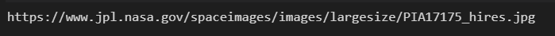
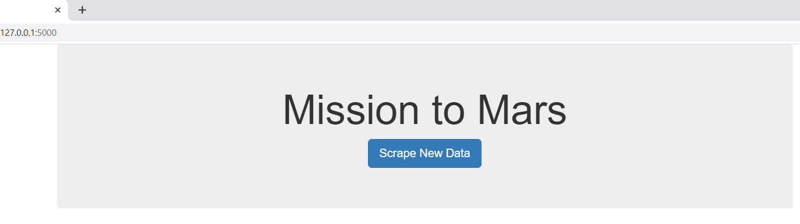
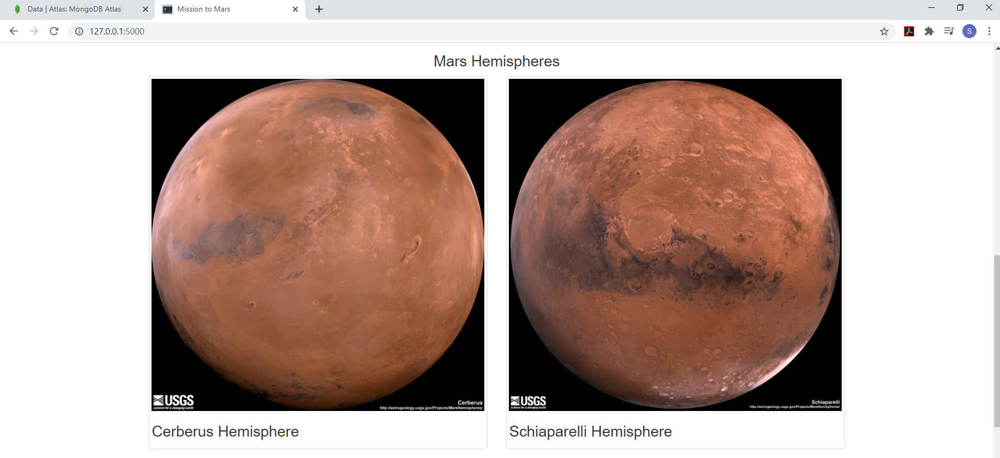

# **Web Scraping Challenge - Mission to Mars**

In this assignment, you will build a web application that scrapes various websites for data related to the Mission to Mars and displays the information in a single HTML page. The following outlines what you need to do.

## Step 1 - Scraping

Complete your initial scraping using Jupyter Notebook, BeautifulSoup, Pandas, and Requests/Selenium/Splinter. Create a Python file called `mission_to_mars.py` and use this to complete all of your scraping and analysis tasks. 
* A file for Jupyter Notebook is added as "mission_to_mars.ipynb". This notebook is used to check web-scraping for the assignment.
* A python file is added as "mission_to_mars.py". This file is also used to check web-scraping for the assignment.

### NASA Mars News

Scrape the [NASA Mars News Site](https://mars.nasa.gov/news/) and collect the latest News Title and Paragraph Text. Assign the text to variables that you can reference later.
* Similar to the "mission_to_mars.ipynb", the python file "mission_to_mars.py" has generated following outcome for scraping the news_title and news_paragraph.

### JPL Mars Space Images - Featured Image

Visit the url for JPL Featured Space Image [here](https://www.jpl.nasa.gov/spaceimages/?search=&category=Mars). Use splinter to navigate the site and find the image url for the current Featured Mars Image and assign the url string to a variable called `featured_image_url`. Make sure to find the image url to the full size `.jpg` image. Make sure to save a complete url string for this image.
* Similar to the "mission_to_mars.ipynb", the python file "mission_to_mars.py" has generated following outcome for scraping the featured_image_url.

### Mars Facts

Visit the Mars Facts webpage [here](https://space-facts.com/mars/) and use Pandas to scrape the table containing facts about the planet including Diameter, Mass, etc. Use Pandas to convert the data to a HTML table string.
* Similar to the "mission_to_mars.ipynb", the python file "mission_to_mars.py" has generated following outcome for scraping the HTML table string.

    

### Mars Hemispheres

Visit the USGS Astrogeology site [here](https://astrogeology.usgs.gov/search/results?q=hemisphere+enhanced&k1=target&v1=Mars) to obtain high resolution images for each of Mar's hemispheres. You will need to click each of the links to the hemispheres in order to find the image url to the full resolution image. Save both the image url string for the full resolution hemisphere image, and the Hemisphere title containing the hemisphere name. Use a Python dictionary to store the data using the keys `img_url` and `title`. Append the dictionary with the image url string and the hemisphere title to a list. This list will contain one dictionary for each hemisphere.
* Similar to the "mission_to_mars.ipynb", the python file "mission_to_mars.py" has generated following outcome for scraping the dictionary of hemisphere_image_urls.

## Step 2 - MongoDB and Flask Application

Use MongoDB with Flask templating to create a new HTML page that displays all of the information that was scraped from the URLs above. Start by converting your Python file into a Python script called `scrape_mars.py` with a function called `scrape` that will execute all of your scraping code from above and return one Python dictionary containing all of the scraped data. Next, create a route called `/scrape` that will import your `scrape_mars.py` script and call your `scrape` function. Store the return value in Mongo as a Python dictionary. Create a root route `/` that will query your Mongo database and pass the mars data into an HTML template to display the data. Create a template HTML file called `index.html` that will take the mars data dictionary and display all of the data in the appropriate HTML elements. 
* The required files - `scrape_mars.py` with `scrape` function, `index.html` with appropriate HTML elements, and `app.py` with MongoDB & Flask - are added for the assignment.
* The screen-shots of the final application are provided below.

## Technologies used for the assignment:
* Python
* Pandas
* Jupyter Notebook
* BeautifulSoup
* Splinter
* HTML
* Jinja
* Flask
* PyMongo
* MongoDB Atlas
* Chromedriver 

